# Best Music Scraper

## Features

- Input
    - [Search by simple query](#search-by-simple-query)
    - [Query by genre](#query-by-genre)
    - [Query by date](#query-by-date)
    - [Query by price range](#query-by-price-range)
    - [Select one or multiple providers](#select-one-or-multiple-providers)
    - [Query](#query)
    - [Reset form](#reset-form)
- Configuration
    - [Configure Sendinblue](#configure-sendinblue)
    - [Configure database connection](#configure-database-connection)
- Output
    - [Export results to file](#export-results-to-file)
    - [Upload results to a database](#upload-results-to-a-database)
    - [Send results as email](#send-results-as-email)
- [Close program](#close)

## Search by simple query

You can search by query, like with the vinyl title or artist name

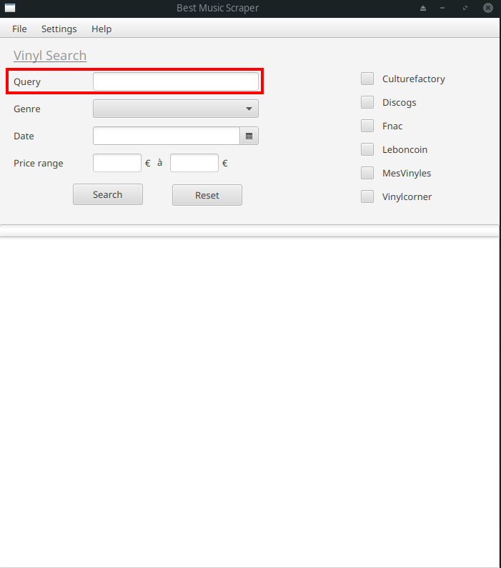

## Query by genre

You can search by genre, by selecting one in the combo box

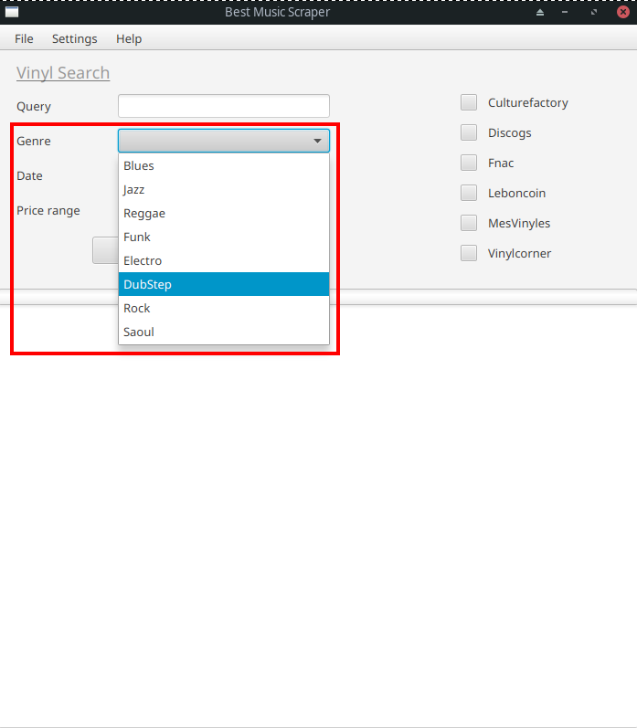

## Query by date

You can search by date, by selecting a year in the date picker

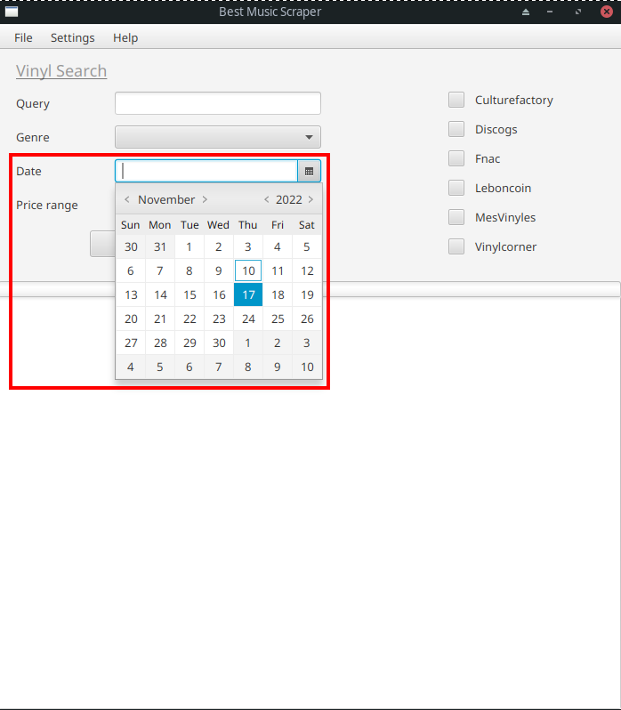

## Query by price range

You can search by price range

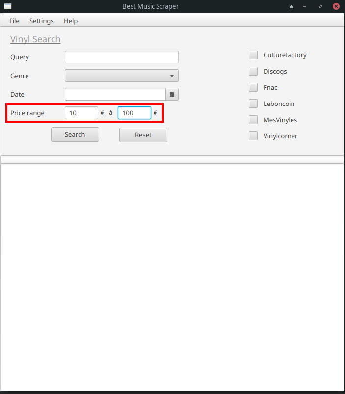

## Select one or multiple providers

You can select one or multiple providers with the checkboxes on the right

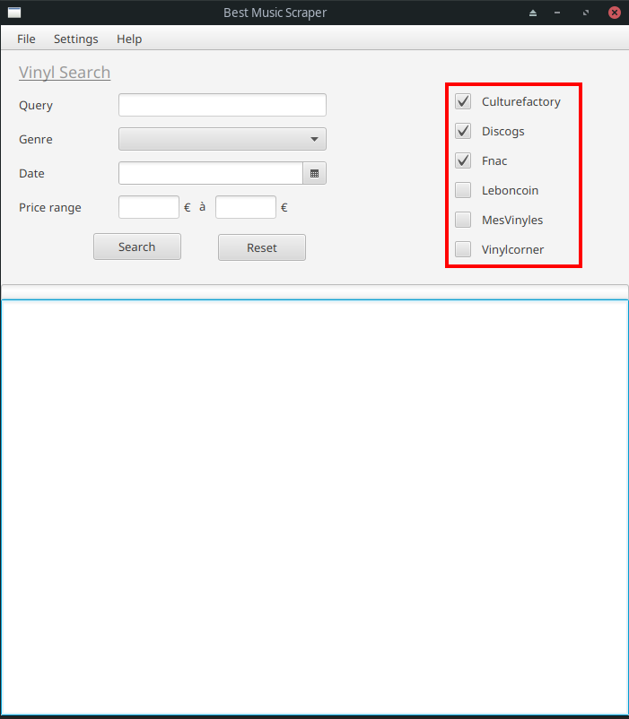

## Query

When you're all good with the query parameters, you can click search to start scraping

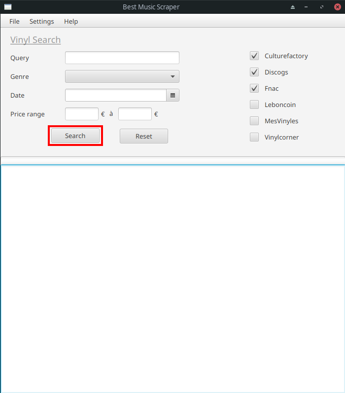

## Reset form

If you want to reset all the form, just click on the reset button

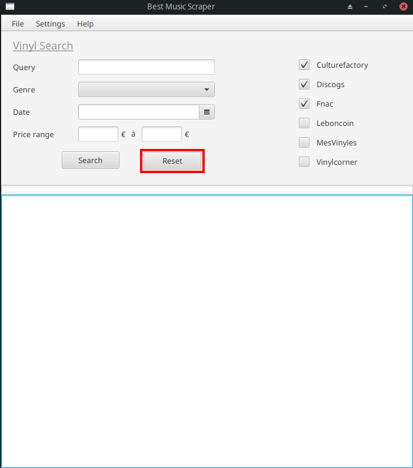

## Configure Sendinblue

Before sending emails, you have to configure sendinblue by going to settings -> sendinblue

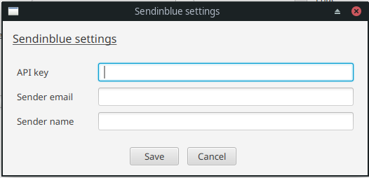

## Configure database connection

Before sending emails, you have to configure sendinblue by going to settings -> database

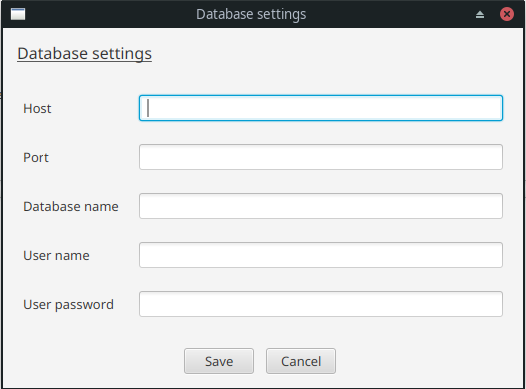

## Export results to file

If you want to export your results to a text file, just click save to files in the Files menu

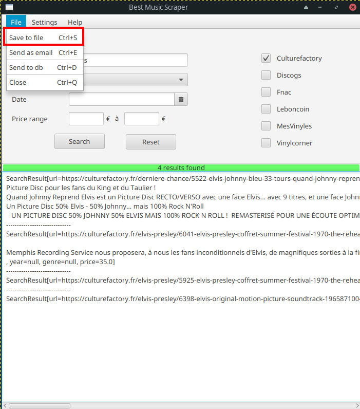

## Send results as email

If you want to send your results as an email, just click send as email in the Files menu. You'll next have to enter the recipient email

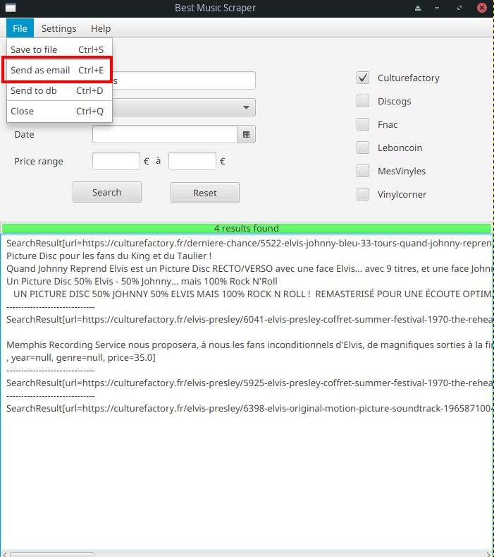
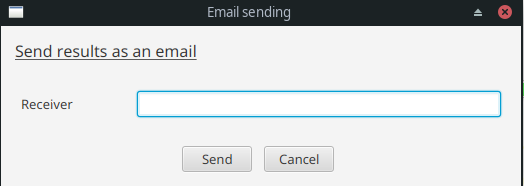

## Upload results to a database

If you want to export your results to a database, just click send to db in the Files menu

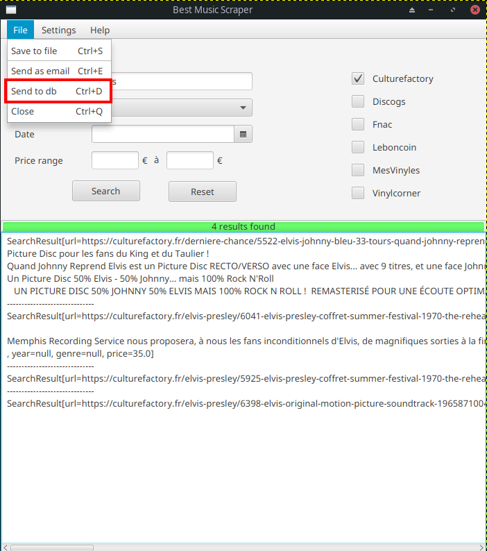
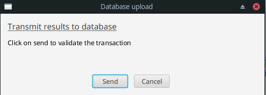

## Close

When you're done with the scraper, just hit Close in the Files menu, or click on the red cross

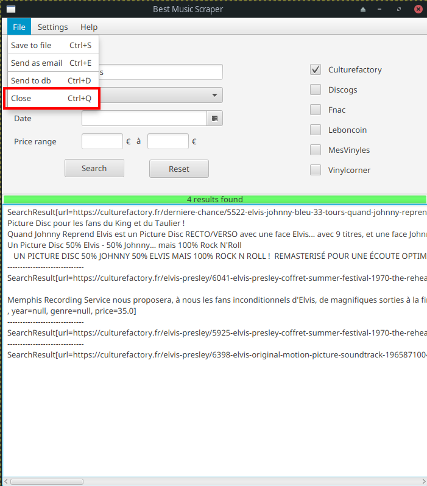